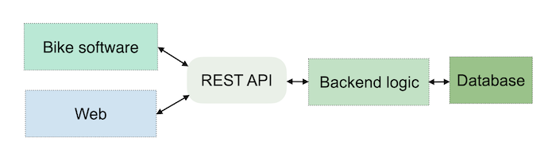
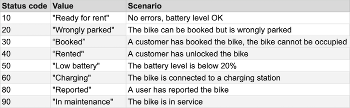

# API Documentation (v1)

## Overview

This REST API allows interaction with the e-scooter sharing platform.
It supports user authentication, bike rentals, city and station management, and payments.
All responses are in JSON format.

## System Flow Overview

The system follows a layered structure:

Frontend (web & mobile) sends requests to the API, the backend handles the logic and communicates with the database.



- Users and administrators interact via the frontend.
- The backend handles authentication, business logic, and CRUD operations through RESTful endpoints.
- The database stores information about users, cities, stations, zones, bikes, payments, and rentals.
- Each bike runs a small program that reports its GPS position, battery level, and status to the backend at regular intervals.

---

## API Endpoints


### Authentication

OAuth 2.0 is used for authentication.
Obtain a token by registering or logging in, then include it in each request:

Authorization: Bearer <token>

### Register

**POST /oauth/register**

Register a new user via OAuth.

#### Request

#### Response

### Login

**POST /oauth/login**

Authenticate a user and receive an access token.

#### Request

#### Response

### Get all cities

#### GET /cities

#### Response

```
[
    { "id": 1, "name": "Stockholm" },
    { "id": 2, "name": "Gothenburg" },
    { "id": 3, "name": "Malmö" }
]
```

### Get a specific city

#### GET /cities/{id}

#### Response

```
{ "id": 1, "name": "Stockholm", "stations": 5, "bikes": 240 }
```

### Add a new city

#### POST /cities

**Admin only**

#### Request

```
{ "name": "Uppsala" }
```

#### Response

```
{ "message": "City added", "id": 3 }
```

### Get all stations

#### GET /stations

#### Response

```
[
    { "id": 1, "cityId": 1, "name": "Central Station", "capacity": 20 },
    { "id": 2, "cityId": 1, "name": "Old Town", "capacity": 15 }
]
```

### Get a specific station

#### GET /stations/{id}

#### Response

```
{ "id": 1, "cityId": 1, "name": "Central Station", "bikes": 10 }
```

### Add a new station

#### POST /stations

**Admin only**

#### Request

```
{ "cityId": 1, "name": "Södermalm", "capacity": 25 }
```

#### Response

```
{ "message": "Station added", "id": 3 }
```

### Get all bikes

#### GET /bikes

#### Response

```
[
    { "id": 1, "cityId": 1, "status": 100, "battery": 85, "lat": 59.33, "lng": 18.07 },
    { "id": 2, "cityId": 1, "status": 400, "battery": 60, "lat": 59.35, "lng": 18.08 }
]
```

### Get a specific bike

#### GET /bikes/{id}

#### Response

```
{
    "id": 1,
    "status": 100,
    "battery": 85,
    "position": { "lat": 59.33, "lng": 18.07 },
    "rentalId": null
}
```

### Update bike information

#### PUT /bikes/{id}

#### Request

```
{
    "status": 600,
    "position": { "lat": 59.32, "lng": 18.09 }
}
```

#### Response

```
{ "message": "Bike updated successfully" }
```

### Create a rental

#### POST /bikes/{id}/rental

### Start a rental for a specific bike.

**Headers**

Authorization: Bearer <token>

#### Request

```
{ "userId": 45, "startLocation": "Central Station" }
```

#### Response

```
{
    "rentalId": 980,
    "bikeId": 1,
    "userId": 45,
    "startTime": "2025-11-12T10:20:00Z",
    "status": "active"
}
```

### End a rental

#### POST /bikes/{id}/rental/end

**Headers**

Authorization: Bearer <token>

#### Request

```
{ "endLocation": "Haga", "duration": 14 }
```

#### Response

```
{
    "rentalId": 612,
    "totalCost": 30.50,
    "status": "completed"
}
```

### Get user details

#### GET /users/{id}

**Headers**

Authorization: Bearer <token>

#### Response

```
{
    "id": 40,
    "name": "Anna Svensson",
    "email": "anna@example.com",
    "balance": 120.0
}
```

### Get user rentals

#### GET /users/{id}/rentals

**Headers**

Authorization: Bearer <token>

#### Response

```
[
    { "rentalId": 980, "bikeId": 1, "duration": 14, "cost": 25.50 },
    { "rentalId": 975, "bikeId": 3, "duration": 22, "cost": 40.00 }
]
```

### Update user balance

#### PATCH /users/{id}/balance

#### Request

```
{ "amount": 50.0 }
```

#### Response

```
{ "message": "Balance updated", "newBalance": 170.0 }
```

### Create a payment

#### POST /payments

**Headers**

Authorization: Bearer <token>

#### Request

```
{ "userId": 45, "amount": 100.0, "method": "card" }
```

#### Response

```
{ "message": "Payment processed", "paymentId": 3002 }
```

### Get payment details

#### GET /payments/{id}

#### Response

```
{
    "paymentId": 1001,
    "userId": 45,
    "amount": 100.0,
    "date": "2025-11-12T11:00:00Z",
    "method": "card"
}
```

### Get all zones

#### GET /zones

#### Response

```
[
    { "id": 1, "cityId": 1, "type": "allowed", "name": "Central Station" }
]
```

### Add a new zone

#### POST /zones

**Admin only**

#### Request

```
{ "cityId": 1, "type": "free_parking", "name": "Grönsakstorget" }
```

#### Response

```
{ "message": "Zone added successfully", "id": 3 }
```

### Status codes



### Example Error Response

```
{
"error": "Unauthorized",
"message": "Missing or invalid access token",
"status": 401
}
```
